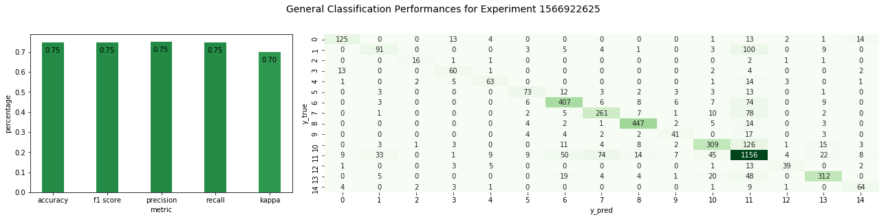
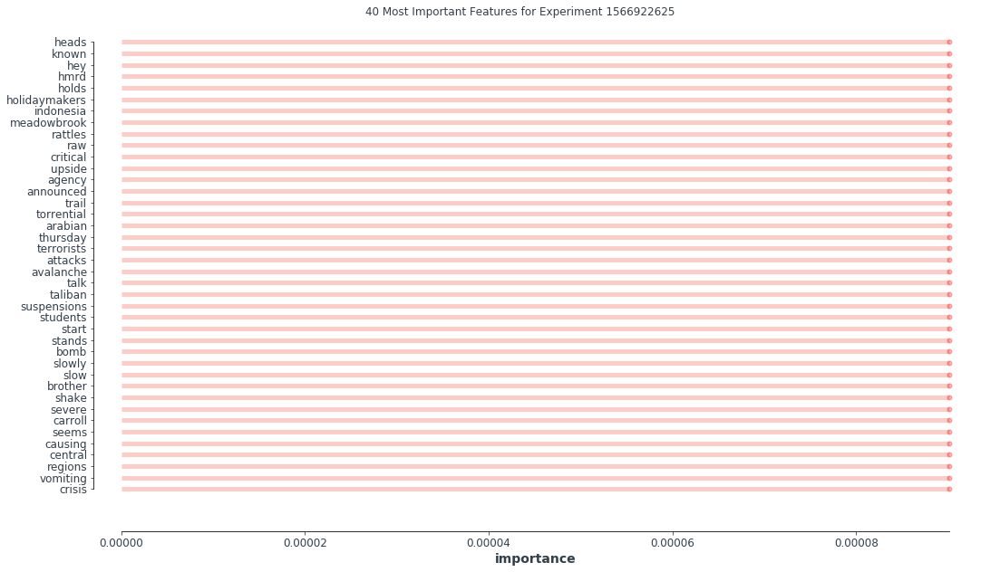
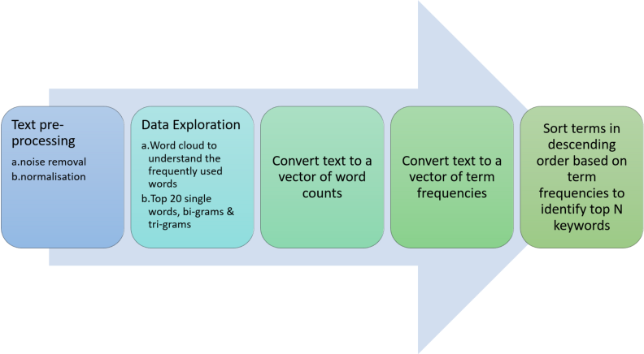

# Machine Learning Model

This notebook presents our strategy to train our vocabulary on disaster-specific data to ultimately improve the quality of our priority score. Given the limited labeled data sets on emergency calls, we decided to use a labeled Twitter data set on natural disasters that was presented by Muhammad Imran, Prasenjit Mitra, Carlos Castillo: Twitter as a Lifeline: Human-annotated Twitter Corpora for NLP of Crisis-related Messages. In Proceedings of the 10th Language Resources and Evaluation Conference (LREC), pp. 1638-1643. May 2016, Portorož, Slovenia. The dataset can be found at https://crisisnlp.qcri.org/lrec2016/lrec2016.html.

The current folder contains ideas and drafted pipelines. The notebook is harder to follow in terms of story-telling, but one would easily be able to understand the training methodology through _modeling.py_, which gathers preprocessing and training.

## General methodology:

- Data Preprocessing and Cleaning: Load the data, merge single files into one dataframe and remove Twitter specific labels and signs.

- Train a Light Boosted Tree (LightGBM Library) on the vectorized text data. We train one against all in for two different types of classes: 
  
  - (1) Content:
    - 'other_useful_information', 
    - 'infrastructure_and_utilities_damage', 
    - 'injured_or_dead_people', 
    - 'not_related_or_irrelevant', 
    - 'donation_needs_or_offers_or_volunteering_services', 
    - 'caution_and_advice', 'sympathy_and_emotional_support', 
    - 'missing_trapped_or_found_people', 
    - 'displaced_people_and_evacuations', 
    - 'affected_people', 
    - 'disease_signs_or_symptoms', 
    - 'prevention', 
    - 'disease_transmission', 
    - 'treatment', 
    - 'deaths_reports'

  - (2) Category:
    - 'storm', 
    - 'eq', 
    - 'flood', 
    - 'virus'

- The output is a list of features and their corresponding feature importance for Content and Category, respectively. This information then serves as an input to determine the priority score of an incoming call.

