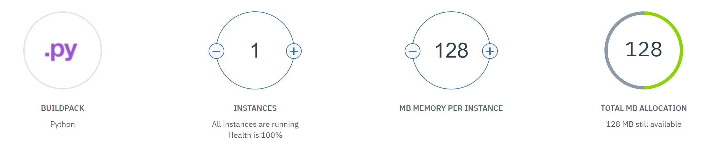

# (Dis)AsTeR - SQL Database Service

This submodule specifically implements the SQL API as we need it. The current micro-service is integrated on the web through a *Cloud Foundry Python Application*, which gives us some flexibility regarding network architecture. Ultimately, this service aims at gathering all the insights received before, during and after the natural disaster / emergencies. It also is the core of our dispatching strategy, by giving the right real-time overview to the dispatchers. 


## Clound Foundry Application

```bash
cf api https://api.ng.bluemix.net
cf auth xxx xxx
cf push
cf logs serviceSQL --recent
```



## API Usage

```python

url = 'https://servicesql-comedic-wallaby.mybluemix.net' 

def check_connection(profile, api_key, url=url):
    
    warnings.simplefilter('ignore')
    
    url = '/'.join([url, 'connect'])
    username, password = profile
    header = {'x-api-key': api_key}
    params = {'username': username, 'password': sha256_crypt.hash(password)}
    req = requests.post(url, headers=header, params=params, verify=False)
    
    return json.loads(req.content)
    
check_connection(('xxx', 'xxx'), 'xxx')

[1]: {'username': 'admin', 'success': True, 'reason': 'None', 'first_name': 'admin', 'last_name': 'admin'}
```


